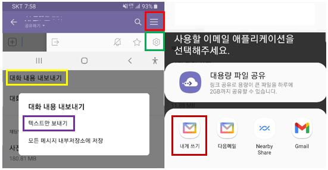

카카오톡 대화 전처리(1)
================
김종헌
2022-01-18

## 데이터 다운로드

데스크탑 컴퓨터에서도 카카오톡 대화를 다운 받을 수 있다. 하지만 데이터
전처리를 쉽게 하려면 스마트폰에서 텍스트를 내보내는 것이 좋다.  
  
  
스마트폰에서 카톡방의 맨 오른쪽 위(빨간색)을 터치한 후 오른쪽 맨
아래쪽에 설정(초록색)을 터치한다. 중간정도 보면 대화내용
내보내기(노란색)를 터치한 후 텍스트만 보내기(보라색)을 터치하면 위
그림의 오른쪽과 같이 어떤 형태로 텍스트를 내보낼지 선택할 수 있다.
본인이 원하는 방법(예, 갈색)를 이용하여 텍스트 파일을 받을 수 있다.

## 원하는 형태의 데이터

다음과 같은 형태의 데이터를 만들어야 한다:

``` r
library(tidyverse)
```

    ## -- Attaching packages --------------------------------------- tidyverse 1.3.1 --

    ## v ggplot2 3.3.5     v purrr   0.3.4
    ## v tibble  3.1.6     v dplyr   1.0.7
    ## v tidyr   1.1.4     v stringr 1.4.0
    ## v readr   2.1.1     v forcats 0.5.1

    ## -- Conflicts ------------------------------------------ tidyverse_conflicts() --
    ## x dplyr::filter() masks stats::filter()
    ## x dplyr::lag()    masks stats::lag()

``` r
(rdata <- read_file("../KakaoTalkChatsSample.txt") %>%                           # txt 파일 읽어오기
        strsplit("\r") %>% unlist() %>%                                          # 같은 사람의 글은 한 줄로
        gsub("\n", "", .) %>% as_tibble() %>%                                    # 줄바꿈 없애고 tibble 형태로
        filter(grepl("^\\d.*,", value)) %>%                                      # 숫자로 시작하고 ,가 있는 것만 선택
        separate(value, into=c("date", "text"), sep=", ", extra="merge") %>%     # 날짜와 글 분리
        separate(text, into=c("name", "coment"), sep=" : ", extra="merge") %>%   # 이름과 글 내용 분리
        filter(!grepl("님이 들어왔습니다.|님이 나갔습니다.", name)) %>%          # 들어오고 나간 메시지 삭제
        mutate(date=gsub("년 ", "-", gsub("월 ", "-", gsub("일 ", " ", date))))) # 년월일 대체 및 삭제
```

    ## Warning: Expected 2 pieces. Missing pieces filled with `NA` in 3 rows [1, 4,
    ## 10].

    ## # A tibble: 13 x 3
    ##    date                 name  coment                                            
    ##    <chr>                <chr> <chr>                                             
    ##  1 2019-2-27 오후 11:02 ◇◇◇   "오늘 강연 고맙게 잘~ 들었습니다 "                
    ##  2 2019-2-27 오후 11:02 □□□   "(굿)"                                            
    ##  3 2019-2-28 오후 7:08  □□□   "사진"                                            
    ##  4 2019-2-28 오후 7:08  □□□   "저희도 동참합니다 ^^"                            
    ##  5 2019-2-28 오후 8:57  ▣▣▣   "(최고)"                                          
    ##  6 2019-3-1 오후 1:26   ◁◁◁   "고생 많으십니다"                                 
    ##  7 2019-3-1 오후 2:03   □□□   "사진"                                            
    ##  8 2019-3-1 오후 2:31   <U+25C9><U+25C9><U+25C9>   "초대 감사합니다ㆍㆍ"                             
    ##  9 2019-3-1 오후 3:19   <U+25AF><U+25AF><U+25AF>   "이모티콘"                                        
    ## 10 2019-3-2 오후 9:18   □□□   "4:30분 부터는 같은 장소에서 <U+25CD><U+25CD><U+25CD> 박사님  기초강의~
    ## 11 2019-3-2 오후 9:18   <U+25B1><U+25B1><U+25B1>   "기초반도 신청해야 하나요?"                       
    ## 12 2019-3-2 오후 9:19   □□□   "신청없이 오셔도 됩니다 ㅎㅎㅎ"                   
    ## 13 2019-3-2 오후 9:21   □□□   "이번 세미나 부터는 넓은 스펙트럼의 분들이 뭔가 ~

## Including Plots

You can also embed plots, for example:

<!-- -->

Note that the `echo = FALSE` parameter was added to the code chunk to
prevent printing of the R code that generated the plot.
