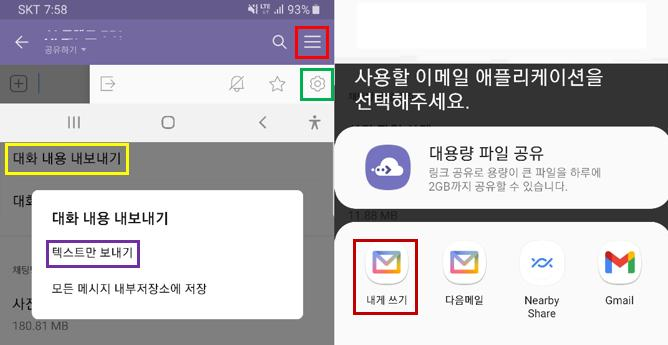

카카오톡 대화 전처리(1)
================
김종헌
2022-01-18

## 데이터 다운로드

데스크탑 컴퓨터에서도 카카오톡 대화를 다운 받을 수 있다. 하지만 데이터
전처리를 쉽게 하려면 스마트폰에서 텍스트를 내보내는 것이 좋다.

스마트폰에서 카톡방의 맨 오른쪽 위(빨간색)을 터치한 후 맨 아래쪽에 보면
설정(초록색)을 터치한다. 중간정도 보면 대화내용 내보내기(노란색)를
터치한 후 텍스트만 보내기(보라색)을 터치하면 위 그림의 오른쪽과 같이
어떤 형태로 텍스트를 내보낼지 선택할 수 있다. 예를들어 daum의 내게
쓰기(갈색)를 이용하여 텍스트 파일을 받을 수 있다.

## 원하는 형태의 데이터

다음과 같은 형태의 데이터를 만들어야 한다:

``` r
library(tidyverse)
```

    ## -- Attaching packages --------------------------------------- tidyverse 1.3.1 --

    ## v ggplot2 3.3.5     v purrr   0.3.4
    ## v tibble  3.1.6     v dplyr   1.0.7
    ## v tidyr   1.1.4     v stringr 1.4.0
    ## v readr   2.1.1     v forcats 0.5.1

    ## -- Conflicts ------------------------------------------ tidyverse_conflicts() --
    ## x dplyr::filter() masks stats::filter()
    ## x dplyr::lag()    masks stats::lag()

``` r
read.csv("../떡볶이 설문.csv") %>% as_tibble() %>% 
    select(성별:연령, 좋았던곳이유개선점) %>% head()
```

    ## # A tibble: 6 x 3
    ##   성별  연령  좋았던곳이유개선점                                                
    ##   <chr> <chr> <chr>                                                             
    ## 1 여    23~26 새우락/청결하고 맛있고 가격이 적당함/사이드 메뉴 추가             
    ## 2 여    20~22 엽떡/가장 맛있다고 생각한다./가끔 국물 농도가 다르게 오는 점(진하~
    ## 3 여    20~22 <NA>                                                              
    ## 4 여    23~26 청년다방 / 버터갈릭감자튀김이 진짜 너무 맛있습니다. 떡볶이 메뉴도~
    ## 5 여    23~26 3점을 보통 점수로 줬고, 제가  근처에서 살면서 7년간 맛봤던  구정~ 
    ## 6 여    23~26 청년다방 / 변치않는 맛과 깔끔함. 친절한 서비스 굿굿 / 치즈볼 줄 ~

## Including Plots

You can also embed plots, for example:

<!-- -->

Note that the `echo = FALSE` parameter was added to the code chunk to
prevent printing of the R code that generated the plot.
