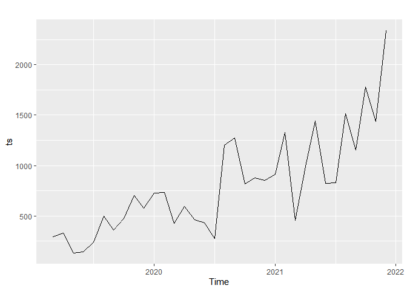

<div class="notice--success">
월별 대화량은 훌륭한 시계열 데이터가 됩니다. 데이터에 적합한 시계열 모델로 텍스트 데이터를 다운 받은 시점 이후의 월별 대화량을 예측해 봅니다.
</div>

## 미션 이해

널리 알려진 ARIMA 모델을 비롯해서 다양한 시계열 모델이 있습니다. 그 중 어떤 모델이 해당 데이터에 가장 적합한지를 먼저 확인해야 합니다. 전체 데이터 중 맨 마지막 2개월의 데이터를 test 데이터로 만들고 나머지를 train 데이터로 만듭니다. train 데이터로 시계열 모델을 만든 후 test 데이터를 예측하게 한 후 오차가 가장 작은 모델을 선정합니다. 모델이 결정되면 전체 시계열 데이터를 바탕으로 향후 2개월의 대화량을 예측해 볼 수 있습니다.

## 최종 결과 확인

### 시계열 데이터 만들기

``` r
pacman::p_load(forecast,                      # 시계열 예측 관련 패키지
               lubridate, tidyverse)          # 데이터 전처리 관련 패키지

rdata <- read_file("KakaoTalkChats.txt") %>%                                 # txt 파일 읽어오기
    strsplit("\r") %>% unlist() %>%                                          # 같은 사람의 글은 한 줄로
    gsub("\n", "", .) %>% as_tibble() %>%                                    # 줄바꿈 없애기
    filter(grepl("^\\d.*,.*:", value)) %>%                                   # 숫자시작 , : 있는 것만
    separate(value, into=c("date", "text"), sep=", ", extra="merge") %>%     # 날짜와 글 분리
    separate(text, into=c("name", "coment"), sep=" : ", extra="merge")       # 이름과 글 내용 분리

data <- rdata %>% 
    mutate(date=gsub("년 ", "-", gsub("월 ", "-", gsub("일 ", " ", date)))) %>%
    mutate(date=gsub("오전", "AM", gsub("오후", "PM", date))) %>%
    mutate(date=parse_date_time(date, c("%Y-%m-%d %p %H:%M"))) %>%      # 날짜 형식으로
    mutate(year=year(date), quarter=quarter(date), month=month(date),   # 년, 분기, 월 변수 만들기
           wday=weekdays(date), yday=yday(date), hour=hour(date),       # 요일, 일수, 시간 변수 만들기
           ampm=ifelse(hour(date)<12, "AM", "PM")) %>%                  # 오전 오후 변수 만들기
    select(year:ampm, name, coment)

ts <- data %>% group_by(year, month) %>% summarise(n=n()) %>% 
    filter(ifelse(year==2019 & month==2, FALSE, ifelse(year>2021, FALSE, TRUE))) %>% 
    pull(n) %>% ts(start=c(2019, 3), frequency=12)
autoplot(ts)
```

<!-- -->

월별 발언량이 많아지고 있는 경향(trend)가 보입니다. 시계열 모델 중에 trend를 가정한 모델이 적절할 것 같다는 생각이 들지만 구체적인 것은 검증을 해봐야 알 수 있습니다.

2019년 2월 데이터와 2022년 데이터는 분석에서 제외하였습니다. 시계열 데이터는 ts() 함수로 만들고 start 파라미터에 시작하는 년과 월을 입력하고 frequency 파라미터를 통해 월별 데이터인지, 주별 데이터인지 등을 지정해주면 됩니다. 월별 데이터는 12, 주별 데이터는 52, 일별 데이터는 365.25 등으로 지정하면 됩니다.

### 데이터 나누기

``` r
(ts_train <- head(ts, round(length(ts)-2)))  # 훈련데이터
```

    ##       Jan  Feb  Mar  Apr  May  Jun  Jul  Aug  Sep  Oct  Nov  Dec
    ## 2019            297  331  134  143  239  496  361  475  702  575
    ## 2020  728  731  424  594  464  433  274 1202 1274  819  877  851
    ## 2021  914 1327  458  990 1443  821  832 1516 1155 1781

``` r
(ts_test <- tail(ts, 2))                     # 테스트데이터
```

    ##       Nov  Dec
    ## 2021 1439 2336

head() 함수로 시작부터 맨 마지막 데이터에서 2개월을 뺀 나머지를 train 데이터로 만듭니다. test 데이터는 tail() 함수를 써서 맨 뒤에서 2개의 데이터만 선택합니다.

### 모델 만들기

``` r
ts_models <- list(
    ARIMA = auto.arima(ts_train),
    ETS = ets(ts_train),
    NAIVE = naive(ts_train, h=2),    
    NNETAR = nnetar(ts_train),      
    BATS = bats(ts_train),           
    TBATS = tbats(ts_train),        
    HOLTW = hw(ts_train, h=2),  
    SES = ses(ts_train, h=2), 
    HOLT = holt(ts_train, h=2),     
    SNAIVE = snaive(ts_train, h=2),
    RWF = rwf(ts_train, h=2),       
    ARFIMA = arfima(ts_train),
    STLF = stlf(ts_train, h=2, robust=T)
)
```

ARIMA 모델의 경우 모델을 만들때는 몇 개의 데이터를 예측할지 파라미터로 지정하지 않아도 됩니다. 예측할 때 몇 개의 데이터를 예측할지를 지정하면 됩니다. 하지만 NAIVE 모델처럼 모델을 만들때부터 몇 개의 데이터를 예측할지 h 파리미터에 지정해 주어야하는 시계열 모델도 있습니다. forecast 패키지에서 지원하는 거의 대부분의 시계열 모델을 만들어서 리스트 형태로 저장합니다.

### 예측 결과 비교하기

``` r
ts_forecasts <- lapply(ts_models, forecast, 2, c(0.8, 0.9, 0.95)) # 모델 적용해서 예측하기

# 모델 평가 지표 뽑아내기
ts_acc <- Reduce(rbind, lapply(ts_forecasts, function(f){forecast::accuracy(f, ts_test)[2, , drop=F]}))
rownames(ts_acc) <- names(ts_forecasts)    # 모델별 이름 저장하기

round(ts_acc[order(ts_acc[,'MAE']),], 3)   # 소수 셋째 자리까지 표기하고 MAE를 기준으로 정렬하기
```

    ##              ME     RMSE      MAE    MPE   MAPE  MASE ACF1 Theil's U
    ## NNETAR  230.355  349.045  262.238  9.436 11.651 0.656 -0.5     0.549
    ## NAIVE   106.500  460.971  448.500 -0.004 23.763 1.123 -0.5     0.619
    ## RWF     106.500  460.971  448.500 -0.004 23.763 1.123 -0.5     0.619
    ## STLF    443.937  647.034  470.715 18.647 20.508 1.178 -0.5     1.020
    ## BATS    488.029  647.213  488.029 21.731 21.731 1.221 -0.5     1.018
    ## HOLTW   430.785  669.116  511.997 17.358 23.001 1.281 -0.5     1.051
    ## SES     523.534  689.377  523.534 23.413 23.413 1.310 -0.5     1.084
    ## ARIMA   379.485  657.844  537.355 14.139 25.110 1.345 -0.5     1.022
    ## HOLT    537.527  688.624  537.527 24.440 24.440 1.345 -0.5     1.079
    ## TBATS   401.062  674.616  542.454 15.282 25.108 1.358 -0.5     1.052
    ## ETS     552.969  700.839  552.969 25.305 25.305 1.384 -0.5     1.096
    ## ARFIMA  559.498  724.561  559.498 25.274 25.274 1.400 -0.5     1.137
    ## SNAIVE 1023.500 1122.735 1023.500 51.313 51.313 2.562 -0.5     1.656

MAE(Mean Absolute Error) 기준으로 NNETAR이 오차가 가장 작습니다. RMSE를 기준으로 해도 NNETAR이 가장 좋은 모델입니다.

시계열 예측은 forecast() 함수로 얻을 수 있습니다. 파라미터로 모델, 예측할 개월수 등을 입력합니다. 모델이 리스트 형태로 저장되어 있기 때문에 lapply() 함수를 이용해서 모델별로 예측값을 얻어서 ts\_forecasts에 저장합니다.

lapply() 함수를 이용해서 예측한 값과 실제 test 값을 비교해서 모델 평가 지표들을 뽑아냅니다. forecast 패키지에서 지원하는 accuracy() 함수로 평가 지표를 뽑아 내야 하는데 lubridate 패키지에서도 accuracy() 함수를 지원하는데 서로 다른 기능을 합니다. 따라서 lubridate 패키지까지 활성화시킨 경우 함수가 겹쳐서 에러가 날 수 있습니다. 그래서 accuracy() 함수 앞에 forecast::를 붙여서 forecast 패키지에서 지원하는 accuracy() 함수를 적용하라는 표시를 해주어야 합니다. 이 경우 rowname이 모두 Test set으로 지정되기 때문에 예측된 값이 저장된 ts\_forecasts 데이터의 name을 읽어서 ts\_acc의 rowname으로 지정해 주어야 합니다.

MAE를 기준으로 정렬시키기 위해 order() 함수를 적용하고 소숫점 셋째자리까지 표현하기 위해 round() 함수를 사용하여 모델 평가지표를 정렬합니다.

## 예고

다음 글에서는 대화량이 많은 사람 3명의 대화만 선택합니다. 대화 내용에서 많이 사용되는 단어를 뽑아내고 해당 단어를 변수로 지정합니다. 단어를 바탕으로 해당 글을 작성한 사람을 맞추는 머신러닝 모델을 만들어서 정확도를 확인해보고 어떤 단어를 기준으로 어떤 사람으로 분류했는지 확인해 보도록 하겠습니다.
